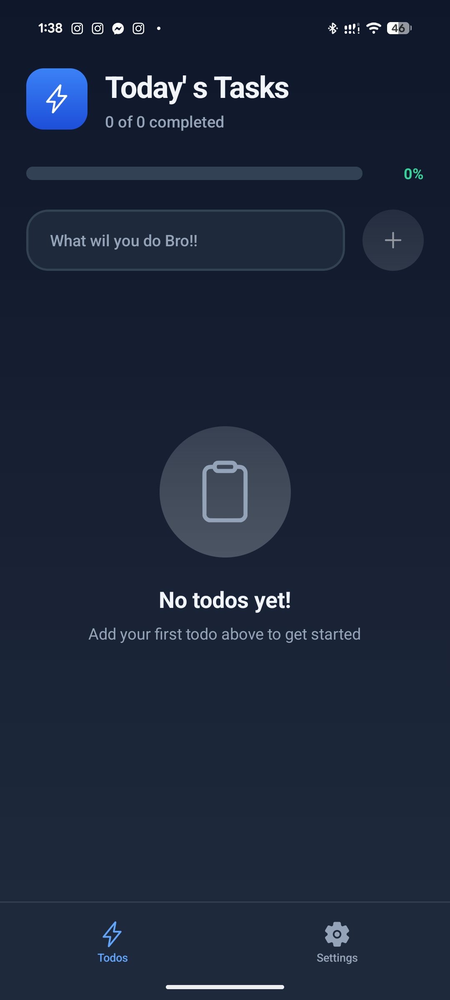
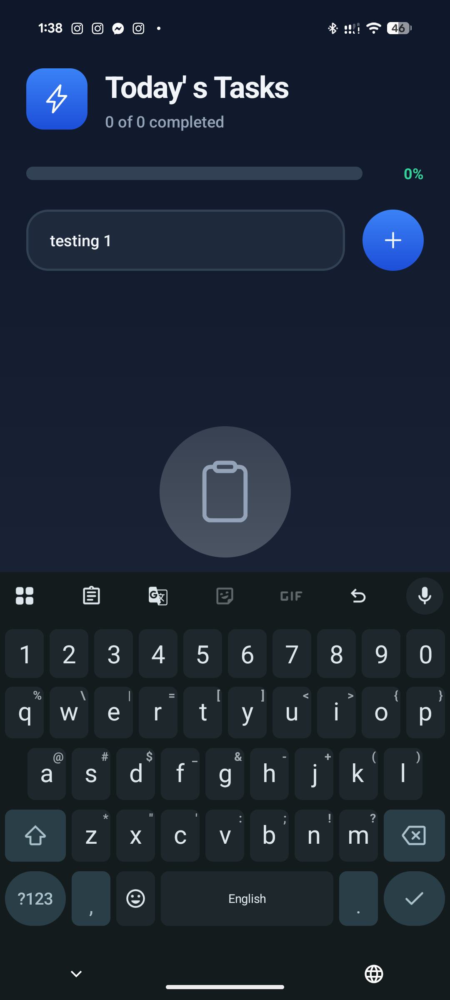
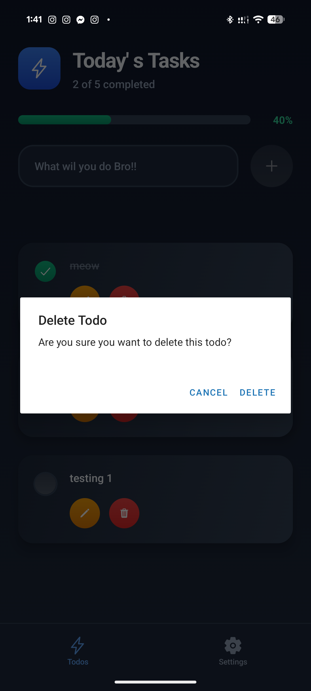

<div align="center">
  
  
  # TODO-APP
  
  ### A modern, feature-rich TODO application built with React Native and Convex backend for real-time data synchronization.
  
  [](https://reactnative.dev/)
  [](https://www.typescriptlang.org/)
  [](https://www.convex.dev/)
  
</div>

---

## 📋 Overview

This TODO application provides a seamless task management experience with real-time updates, built using React Native for cross-platform mobile development and Convex for backend infrastructure.

## ✨ Features

- ✅ Create, read, update, and delete tasks
- 🔄 Real-time synchronization across devices
- 📱 Cross-platform support (iOS & Android)
- 🎨 Clean and intuitive user interface
- 🔐 Secure data management with Convex
- ⚡ Fast and responsive performance

## 🛠️ Tech Stack

- **Frontend**: React Native, TypeScript
- **Backend**: Convex
- **Development Tools**: 
  - ESLint for code quality
  - TypeScript for type safety
  - React Native CLI/Expo for development

## 📁 Project Structure

```
TODO-APP/
├── app/              # Main application screens and navigation
├── assets/           # Images, fonts, and other static resources
├── components/       # Reusable React components
├── convex/           # Convex backend functions and schema
├── hooks/            # Custom React hooks
├── screenshots/      # App screenshots for documentation
│   ├── no-todos.png
│   ├── adding-todo.png
│   ├── todo-list.png
│   ├── editing-todo.png
│   ├── deleting-todo.png
│   ├── settings.png
│   ├── light-mode.png
│   ├── dark-mode.png
│   └── reset-app.png
├── .vscode/          # VS Code configuration
├── .env.example      # Environment variables template
├── app.json          # App configuration
├── package.json      # Project dependencies
├── tsconfig.json     # TypeScript configuration
└── eslint.config.js  # ESLint configuration
```

## 🚀 Getting Started

### Prerequisites

Before you begin, ensure you have the following installed:
- Node.js (v14 or higher)
- npm or yarn
- React Native development environment
- Convex CLI

### Installation

1. **Clone the repository**
   ```bash
   git clone https://github.com/niteboy17/TODO-APP.git
   cd TODO-APP
   ```

2. **Install dependencies**
   ```bash
   npm install
   # or
   yarn install
   ```

3. **Set up environment variables**
   ```bash
   cp .env.example .env
   ```
   Edit the `.env` file and add your Convex deployment URL and other required credentials.

4. **Set up Convex**
   ```bash
   npx convex dev
   ```
   This will initialize your Convex backend and provide you with your deployment URL.

5. **Start the development server**
   ```bash
   npm start
   # or
   yarn start
   ```

6. **Run on your device**
   - For iOS:
     ```bash
     npm run ios
     # or
     yarn ios
     ```
   - For Android:
     ```bash
     npm run android
     # or
     yarn android
     ```

## 🔧 Configuration

### Environment Variables

Create a `.env` file based on `.env.example` and configure the following:

```env
CONVEX_DEPLOYMENT=your-convex-deployment-url
# Add other environment variables as needed
```

### Convex Setup

1. Sign up for a [Convex account](https://www.convex.dev/)
2. Create a new project
3. Copy your deployment URL to the `.env` file
4. Deploy your Convex functions:
   ```bash
   npx convex deploy
   ```

## 📸 Screenshots

### Main Features

<div align="center">

| Empty State | Adding Todo | Todo List |
|-------------|-------------|-----------|
|  |  |  |

| Editing Todo | Deleting Todo | Settings Tab |
|--------------|---------------|--------------|
|  |  |  |

</div>

### Theme Support

<div align="center">

| Light Mode | Dark Mode | Reset App |
|------------|-----------|-----------|
|  |  |  |

</div>

## 📱 Usage

1. **Add a Task**: Tap the "+" button to create a new task
2. **Complete a Task**: Tap on a task to mark it as complete
3. **Edit a Task**: Long press on a task to edit its details
4. **Delete a Task**: Swipe left on a task to delete it
5. **Switch Theme**: Navigate to Settings tab to toggle between light and dark mode
6. **Reset App**: Use the reset option in Settings to clear all data

## 🧪 Testing

Run the test suite:
```bash
npm test
# or
yarn test
```

## 🏗️ Building for Production

### iOS
```bash
npm run build:ios
# or
yarn build:ios
```

### Android
```bash
npm run build:android
# or
yarn build:android
```

## 🤝 Contributing

Contributions are welcome! Please follow these steps:

1. Fork the repository
2. Create your feature branch (`git checkout -b feature/AmazingFeature`)
3. Commit your changes (`git commit -m 'Add some AmazingFeature'`)
4. Push to the branch (`git push origin feature/AmazingFeature`)
5. Open a Pull Request

## 📄 License

This project is open source and available under the [MIT License](LICENSE).

## 👤 Author

**niteboy17**
- GitHub: [@niteboy17](https://github.com/niteboy17)

## 🙏 Acknowledgments

- [React Native](https://reactnative.dev/) - Mobile framework
- [Convex](https://www.convex.dev/) - Backend platform
- [TypeScript](https://www.typescriptlang.org/) - Type safety

## 📞 Support

If you have any questions or need help, please:
- Open an issue in the [GitHub repository](https://github.com/niteboy17/TODO-APP/issues)
- Check the [Convex documentation](https://docs.convex.dev/)
- Review the [React Native documentation](https://reactnative.dev/docs/getting-started)

## 🔄 Updates

Stay tuned for upcoming features:
- [ ] User authentication
- [ ] Task categories and tags
- [ ] Due dates and reminders
- [ ] Dark mode support
- [ ] Task sharing and collaboration

---

⭐ If you find this project helpful, please consider giving it a star on GitHub!
